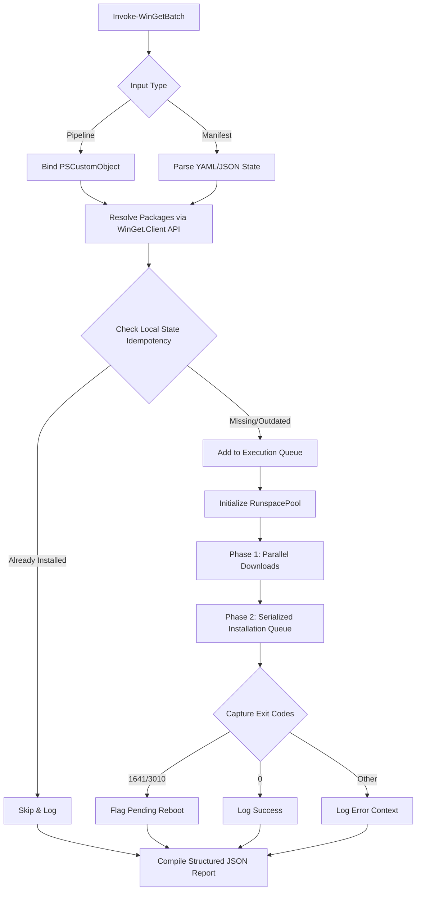

# Next-Generation wingetbatch Architecture

This document outlines the architectural roadmap for transitioning `wingetbatch` from a command-line wrapper to an enterprise-grade, declarative package management system.

---

## 1. Executive Summary & Current Limitations

The native Windows Package Manager (`winget.exe`) is designed primarily for interactive, single-user CLI execution. When wrapper modules attempt bulk operations, they typically fall back to iterating single commands via synchronous loops. This introduces several critical limitations:

* **Synchronous Bottlenecks:** Network downloads and disk installations block one another sequentially, failing to optimize available network bandwidth.
* **Fragile Object Governance:** Relying on regular expression scraping of CLI stdout rather than strongly-typed system objects leads to regression risks whenever the CLI output schema changes.
* **State Ignorance:** Lack of declarative machine state verification prior to execution leads to redundant processing and unnecessary network requests.

---

## 2. Core Architectural Pillars

### A. COM API Migration (`Microsoft.WinGet.Client`)
We will deprecate regular expression parsing of stdout in favor of binding directly to the native Windows Package Manager COM interfaces via the `Microsoft.WinGet.Client` module.

> [!NOTE]
> This transition allows the module to query the local SQLite index and package sources directly. It yields strongly-typed `[PSCustomObject]` outputs, making native PowerShell pipeline filtering and error handling resilient.

```powershell
# Conceptual implementation binding to the COM catalog
$Catalog = New-Object -ComObject "Microsoft.WinGet.Client"
# Native query resolution returning structured objects
```

### B. Split-Phase Concurrency (RunspacePools)
To bypass Windows Installer (`MSI`/`MSIX`) engine execution mutex locks, the execution cycle is split into two asynchronous phases:

1. **Phase 1: Parallel Downloads** - Uses a `RunspacePool` to parallelize multiple network fetch requests, pre-caching setup packages locally.
2. **Phase 2: Serialized Installation Queue** - Dynamically consumes the cache and fires installations sequentially, preventing mutex collision.

### C. Declarative State Management & Idempotency
Introducing manifest-driven deployments via standard JSON or YAML state definitions.

```yaml
# state.yaml
packages:
  - id: Git.Git
    version: latest
  - id: Python.Python.3.11
    version: 3.11.5
```
Prior to execution, the engine verifies the local machine state against the target manifest. If the requested package is already present at the correct version, the step is bypassed.

### D. Advanced Exit Code Mapping & Telemetry
Trap and standardize the wide variety of third-party installer exit codes:

* **`0`**: Success
* **`3010`**: Success (Reboot Required)
* **`1641`**: Success (Reboot Initiated)
* **`Other`**: Captured error code with standard diagnostic telemetry

---

## 3. High-Level System Workflow


